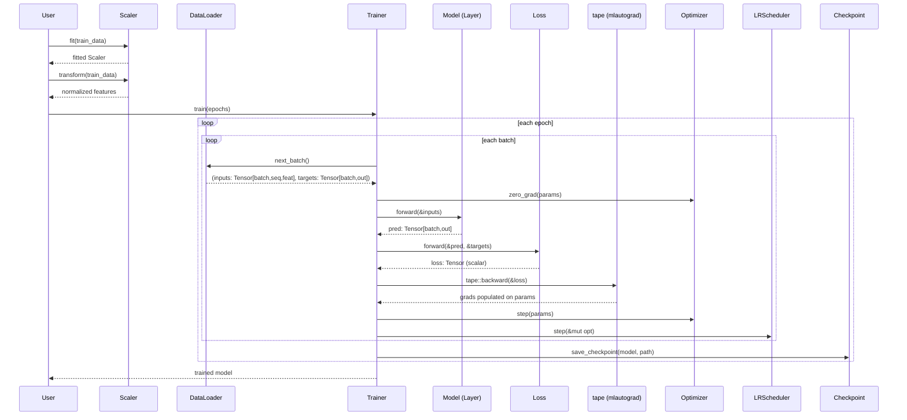
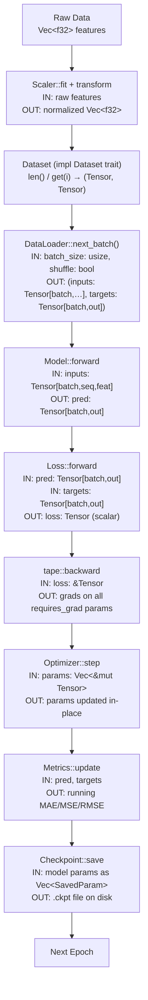

# mltraining — Architecture

## Overview

`mltraining` is the umbrella crate for the ml* stack. It wires together `mlautograd` (automatic differentiation), `mllayers` (model building blocks), and `mloptim` (optimizers and schedulers) into a complete training system. On top of those re-exports it provides its own modules: differentiable loss functions, a data pipeline (`Dataset`, `DataLoader`, `Scaler`), the `Trainer` loop that drives the forward–loss–backward–step cycle, evaluation `Metrics`, and `Checkpoint` serialization. Downstream consumers — model architectures in llmeco and any application code — depend on `mltraining` as their single entry point for the entire ml* type surface.

---

## Stakeholders & Concerns

| Stakeholder | Role | Primary Concern |
|-------------|------|-----------------|
| Consumers | Model authors and application code that `use mltraining::*` | One import gives access to the entire ml* stack; training loop is correct and reproducible |
| Maintainers | Engineers extending loss functions, metrics, or the trainer | Trainer ownership model is clear; no lifetime tangles between model, optimizer, and data |
| Contributors | Adding new loss functions or pipeline stages | `Loss` and `Dataset` traits have minimal, stable contracts; module boundaries are clean |

---

## Component Diagram

```
mltraining
├── lib.rs                        (umbrella facade — re-exports mlautograd, mllayers, mloptim)
│
├── loss.rs                       [Loss trait]
│   └── forward(&Tensor, &Tensor) -> MlResult<Tensor>
│
├── dataset.rs                    [Dataset trait]
│   └── len() / get(i) / input_shape() / target_dim()
│
├── lossfunction/
│   ├── mse_loss.rs   → MSELoss
│   ├── mae_loss.rs   → MAELoss
│   ├── huber.rs      → HuberLoss         (delta as field)
│   ├── cross_entropy.rs → CrossEntropyLoss
│   └── quantile.rs   → QuantileLoss      (quantile as field)
│
├── pipeline/
│   ├── dataloader.rs → DataLoader        (next_batch(); no Iterator impl)
│   └── scaler.rs     → Scaler, ScalerType (MinMax | Standard)
│
└── runner/
    ├── trainer.rs    → Trainer           (owns model + optimizer; train loop)
    ├── metrics.rs    → Metrics           (MAE, MSE, RMSE accumulator)
    └── summary.rs    → model_summary     (prints parameter counts)

checkpoint/
└── mod.rs            → Checkpoint, SavedParam, save_checkpoint, load_checkpoint
```

---

## Layer Responsibilities

| Module | Responsibility |
|--------|---------------|
| `lib.rs` | Re-exports the entire ml* public surface; single dependency point for consumers |
| `loss.rs` | Defines the `Loss` trait — one method, `forward`, returning a differentiable scalar tensor |
| `dataset.rs` | Defines the `Dataset` trait — provides length, indexed access, shape metadata |
| `lossfunction/*` | Implements concrete loss functions; stateless except for configuration fields (delta, quantile) |
| `pipeline/dataloader.rs` | Wraps a `Dataset`, yields batches via `next_batch()`, optionally shuffles index order each epoch |
| `pipeline/scaler.rs` | Fits normalization statistics on training data; applies forward and inverse transforms |
| `runner/trainer.rs` | Owns model and optimizer; drives the `zero_grad → forward → loss → backward → step → scheduler` cycle |
| `runner/metrics.rs` | Accumulates per-batch predictions and targets; computes epoch-level regression metrics |
| `runner/summary.rs` | Walks `Layer::parameters()` and prints a human-readable parameter count table |
| `checkpoint/mod.rs` | Serializes `SavedParam` (name + flat `Vec<f32>`) to disk; deserializes and restores into a model |

---

## Data Flow

```
Raw data (arrays / files)
        │
        ▼
  Scaler::fit(data)              ← compute mean/std or min/max on training split
  Scaler::transform(data)        ← normalize features in-place
        │
        ▼
  DataLoader::new(dataset, batch_size, shuffle)
        │
        ▼
  Trainer::train(epochs)
    ├─ DataLoader::next_batch()  ← yields (inputs: Tensor, targets: Tensor)
    ├─ model.forward(inputs)     ← Layer trait — uses mllayers
    ├─ loss_fn.forward(pred, tgt)← Loss trait — returns scalar Tensor
    ├─ tape::backward(loss)      ← mlautograd — fills .grad on all params
    ├─ clip_grad_norm (optional) ← mloptim free function
    ├─ optimizer.step(params)    ← mloptim — updates .data, clears .grad
    ├─ scheduler.step(&mut opt)  ← mloptim — adjusts LR
    └─ metrics.update(pred, tgt) ← accumulates batch stats
        │
        ▼
  save_checkpoint(model, path)   ← on improvement or end of training
        │
        ▼
  load_checkpoint(model, path)   ← restore for inference or resumed training
```

---

## Sequence Diagram



## Dataflow Diagram



---

## Design Decisions

1. **`mltraining` is the umbrella crate** — downstream consumers depend on only one crate. All ml* public types are available via `use mltraining::*`, eliminating the need to manage separate version pins for mlautograd, mllayers, and mloptim.

2. **`Trainer` takes ownership of model and optimizer** — avoids lifetime tangles. The model is accessible via `trainer.model()` after training completes. Ownership ensures the training loop has exclusive access throughout.

3. **`Loss` trait operates on `&Tensor` pairs** — loss functions are stateless. Configuration (delta for Huber, quantile level for QuantileLoss) is stored as a field on the struct, not threaded through the trait method. This keeps the trait contract minimal and stable.

4. **`DataLoader` does not implement `Iterator`** — `next_batch()` is a method rather than a trait impl to avoid lifetime issues with the borrowed `Dataset`. The caller controls the loop.

5. **`Checkpoint` uses `SavedParam` (name + flat `Vec<f32>`)** — the serialization format is human-inspectable and framework-agnostic. It does not depend on any internal tensor representation, so checkpoints remain loadable if internal data structures change.

---

## Integration Points

| System | Integration | Notes |
|--------|-------------|-------|
| `mlautograd` | `tape::backward` drives the backward pass inside `Trainer::train`; `Tensor`, `MlError`, `MlResult` are re-exported | All gradient computation originates here |
| `mllayers` | `Layer` trait used for the model held by `Trainer`; activations and layer types re-exported | Layer parameters are collected via `Layer::parameters_mut()` for the optimizer |
| `mloptim` | `Optimizer::step` updates parameters after backward; schedulers and grad-clip utilities re-exported | Full mloptim surface re-exported through mltraining |
| `llmeco` architectures | Import `mltraining` as the single dep for the entire ml* stack | Architecture crates call `use mltraining::*` and never depend on mlautograd/mllayers/mloptim directly |

---

## See Also

- [Overview](../README.md)
- [Integration Guide](integration.md)
